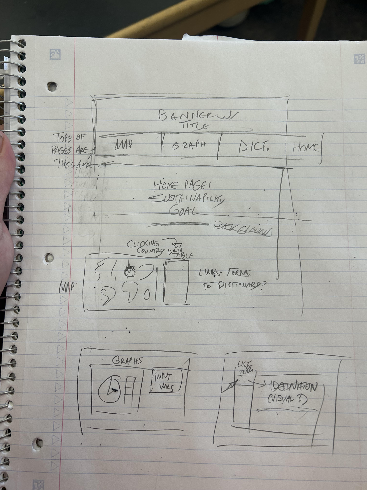

# Title
Global Water Sources v Spending

# Sustainable Development Goal(s)
Responsible consumption & production/Clean water & sanitation

# Features
* Ability to compare a country's water use efficiency over a span of time.
* Ability to find the per-capita water usage as well as the split of household/industrial/agricultural suage split.

## Feature 1/2: Identify proportonality of country's water usage & Country per capita water usage

* Person responsible: Lloyd, Paul
* User story: As someone intersted in the USA's water usage, I want to see what percentage of it's water is going to Agricultutal usage, Industrial usage and Household usage, as well as it's water usage per capita in the year 2020 . Upon inputting USA find that the cooresponding percentages for the most recent year are 47.45%, 25.27%, 27.54%. It also responds that the usage per capita is 292.97 litres per day.
* Acceptance Criteria: 
    * User can input "country_usage_breakdown canada" and it responds with the dates (accurate for 2020) of "Agricultral: 57%, Industrial: 26.7%, Household: 26.4%". 
    * User can also input "python3 command_line.py Japan perCapita 2018" and it will respond with "Japan's Water Usage per Capita: 290.58 Liters per day"

## Feature 3: Water usage over time
* Person responsible: Jay
* User story: I want to find out how the water efficiency in Uzbekistan changed between 2002 and 2003. I can give a country and 2 years to the CLI and it will return how water usage has changed. I input "US, 2002, 2003" and the code responds w/ a change of "0.02 US$/m^3"
* Acceptance Criteria: User can input "python3 command_line.py uzbezistan 2002 2003" and will recive the values of water efficiency for those two years, as well as how they've changed.

# Datasets Metadata
* Name: FAO AQUASTAT Dissemination System
    - URL: https://data.apps.fao.org/aquastat/?lang=en
    - Downloaded: 01/12/26
    - Authorship: Food and Agriculture Organization
    - Terms and Conditions: https://www.fao.org/contact-us/terms/en

* Name: Global Water Consumption Dataset (2000-2024) 🌍💧
    - URL: https://www.kaggle.com/datasets/atharvasoundankar/global-water-consumption-dataset-2000-2024
    - Downloaded:  01/12/26
    - Authorship: Atharva Soundankar
    - Terms and Conditions: CC0:Public Domain

# Mock up

# Data story
Hi! Lloyd typing! 
Originally Jay wanted to do something involving water waste due to cooling. When me and Paul met, we were talking about this water thing and began to do research. This research eventually led me to realize that the word "withdrawl" was being used in a confusing way, both as "where water is being taken from" and "where water is being used". Thus came the idea to start comparing those two datapoints. 

The first dataset was found mostly by me attempting to track down "breakdowns of what kinds of water sources people get water from" and this was not only essentially the only global data on the subject but also incredibly verbose about practically everything you could want to know on the subject. The second was found significantly earlier in the search but it covers data in more general terms than the first (the over-complexity of the first is arguably it's biggest flaw and we are not even using the whole thing.)